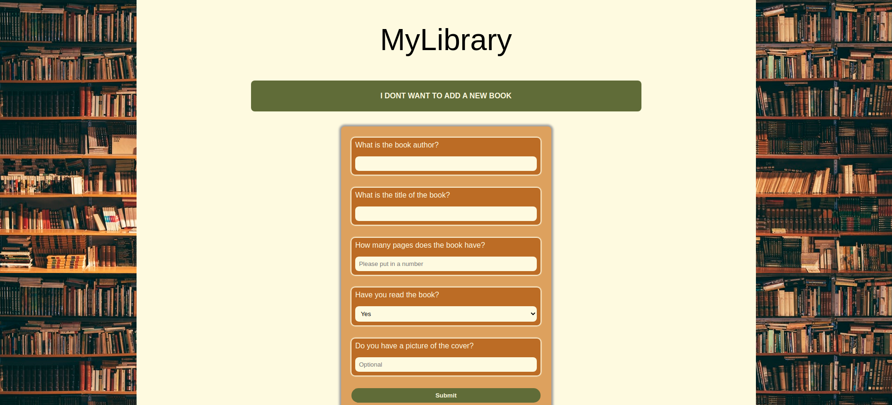

# MyLibrary

> MyLibrary is a personal library type website where you can create
> a repertoire of books you have read or want to read

## Table of contents

- [Overview](#overview)
  - [Features](#features)
  - [Screenshot](#screenshot)
  - [Links](#links)
- [My process](#my-process)
  - [Built with](#built-with)
- [Author](#author)

## Overview

### Features

- [x] Create books as objects with a constructor through filling the form
- [x] Book objects displayed with a read status, name, pages, author and a cover of the book if you have one
- [x] Use of localstorage to be able to come back to a full library
- [x] Fully responsive and mobile friendly

### Screenshot

### Links

> View the project [here](https://funkosaur.github.io/Library/)

## My process

### Built with

- HTML5
- CSS
- Flexbox
- CSS Grid
- Desktop-first workflow
- Javascript

## Author

- Website - [Mario Boykovski](https://github.com/funkosaur)
 
